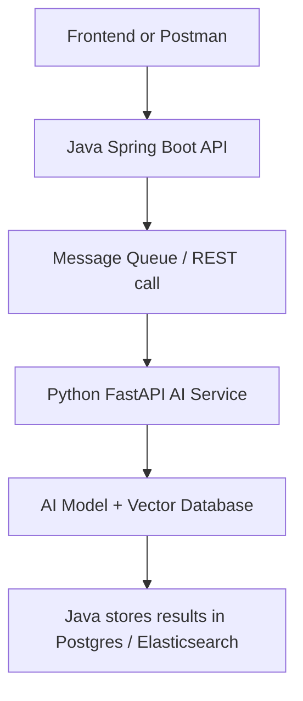

# Smart Resume Screener — Java Microservice + Python AI Module

## High-Level Idea

A system that:

- Accepts a PDF/DOC resume upload via a Java Spring Boot REST API.
- Sends it to a Python AI service (using an LLM and embeddings) for:
    - Skills extraction
    - Experience analysis
    - Job-fit scoring for a given role.
- Returns a structured JSON report to the client.
- Stores results in a database and allows search/filter.

**Why this is great:**

- Involves Java, Python, REST API design, AI model usage, and database integration.
- Mirrors real enterprise AI adoption: integrating AI into existing Java-based systems.

## Architecture Overview

## Tech Stack

- **Java:** Spring Boot (REST API, security, data persistence)
- **Python:** FastAPI (AI logic using OpenAI API or Hugging Face)
- **Database:** PostgreSQL + optional Elasticsearch for searching resumes
- **AI Model:** OpenAI GPT-4 / Hugging Face BERT for embeddings
- **Integration:** REST or Kafka for async communication
- **Deployment:** Docker + Kubernetes (Minikube or Azure)

## Core Features

### Upload Resume API (Java)

- **Endpoint:** `POST /api/resumes/upload`
- Accepts file + target job description text.
- Stores raw file in blob storage (e.g., local or Azure Blob).

### AI Processing (Python)

- Reads resume text (using pdfminer or docx parser).
- Uses embeddings + LLM to extract:
    - Skills list
    - Years of experience per skill
    - Education summary
    - Job-fit score (match % against given JD)

### Return & Store Result (Java)

- Receives structured JSON from Python service.
- Stores it in PostgreSQL.
- Optionally index in Elasticsearch for fast keyword search.

### Search API (Java)

- **Endpoint:** `GET /api/resumes/search?skill=Java&minExperience=5`
- Filters based on stored AI analysis.
